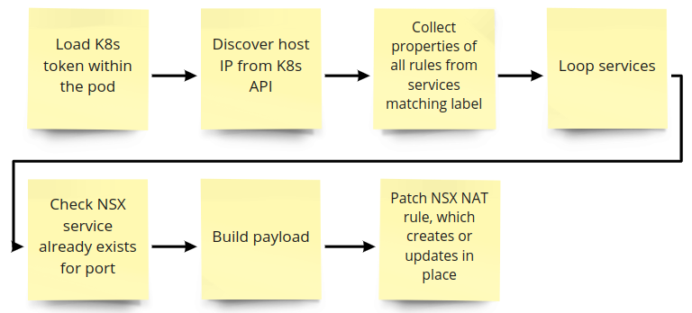
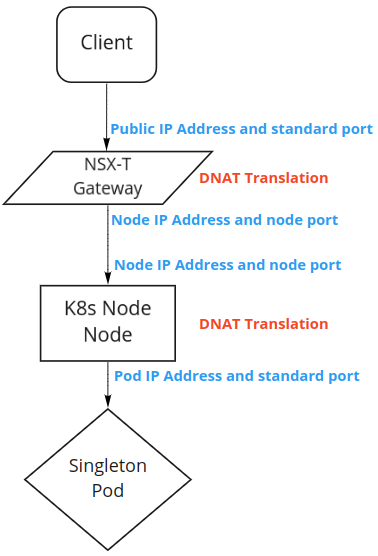

# k8s-nsx-natter
This repo contains the proof of concept code to run inside an init container to enable NSX-T NAT rules to send traffic down to the pod.</br>
The use case is for services such as SCTP which are not compatible with most load balancers, but also do not need to be load balanced.</br>
These scripts and not for production use and come with no guarantee or support and are used at consumers own risk.</br>

## Background
Kubernetes init containers are containers which must complete before the main container in a pod is run. This can be used to run start up scripts and in this example it is used to discover the IP address where a pod is running, then push configuration into NSX-T to enable a DNAT rule to forward traffic to the node port where a service is running.

## Setup
- Services must be created in NSX-T for each of the service types used. The name must be <protocol>-<port>, e.g. sctp-4000.</br>
- A secret must set within the namespace containing the NSX-T password. See the [example](manifests/example-usage.yml).</br>
- A service account, role and role bindings must be set to allow access to the Kubernetes API. See the [example](manifests/example-usage.yml).</br>
- Any Kubernetes service that is used by the pod must be labelled. This should then match the environment variable `SERVICE_LABEL` within the init container. See the [example](manifests/example-usage.yml).</br>
- NSX-T connections details need to be added as env vars to the init container. See the [example](manifests/example-usage.yml)
- The Kubernetes services also need to have the `nsx_nat` annotations set. See the [example](manifests/example-usage.yml).</br>

## Usage
Once all the necessary objects are in place, the pod spec must be updated to add the init container. As shown below the env variables `SERVICE_KEY` and `SERVICE_PREFIX` must match the label assigned to the services needed. The `secretRef` `name` must be the name of the secret in the namespace containing the NSX password.
```
spec:
  initContainers:
  - name: nsx-natter
    image: laidbackware/nsx-natter:latest
    env: 
    - name: SERVICE_KEY
      value: "app"
    - name: SERVICE_PREFIX
      value: "natter-example-pod"
    - name: NSX_MANAGER_FQDN
      value: 192.168.0.161
    - name: NSX_USERNAME
      value: admin
    envFrom:
    - secretRef:
        name: nsx-secret
```

## Architecture
`k8s_nas_natter.py` orchestrates the following workflow. This happens within the init container at every pod start. 

The NSX-T Gateway is performing DNAT translation like any load balancer or reverse proxy, but in this case there is only ever 1 backend. For a pod to move to another host the init container would update the NAT rule to modify the translated IP to the new host IP where the container resides.</br>

